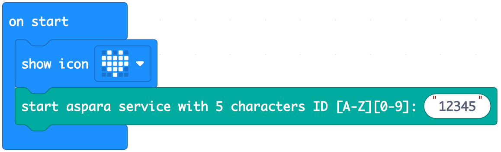

# aspara micro:bit MakeCode Extension
This is the micro:bit MakeCode Extension for controlling the aspara Smart Grower by [Growgreen Limited](https://www.grow-green.com/)

## How to add aspara micro:bit MakeCode Extension to your MakeCode project

* Create/Open a MakeCode project using the micro:bit MakeCode Editor at https://makecode.microbit.org
* In the web editor, click on <B>"Extensions"</B> to add extensions to the project

    

* Enter "<I><B>https://github.com/growgreenhk/aspara-microbit-makecode-extension</B></I>" and search

    

* Select the <B>"aspara-smart-grower"</B> from the search results.

    

* Select <B>"Remove extension(s) and add aspara-smart-grower"</B> if a pop-up appears with the message <B>"Some extensions will be removed"</B>

    

* <B>"aspara Smart Grower"</B> will show up in the editor and be ready to use.

    

## How to use the extension
### On start - assign an unique microbit ID for the project
* Add <B>"start aspara service with 5 characters ID [A-Z][0-9]"</B> from the aspara Smart Grower extension to the block <B>"on start"</B>
* Enter an ID for this project.
* E.g.

    
### Control blocks
* Set LED (red/blue/white) lights intensity (0 - 100)%

    

* Set front panel indicators (8 indicators) on/off

    

* Set pump on/off

    
    
* Play a short/long beep sound

    

### Value blocks
* (red/blue/white) LED intensity (0 - 100)%

    

* Indicators (1 - 8) state (on / off)

    

* Key pressed count (key 1 - 8)

    

* Pump state (on / off)

    

* Room temperature (°C) from aspara Wireless Planting Sensor

    
    
* Relative humidity (%) from aspara Wireless Planting Sensor

    

* Light intensity (Lux) from aspara Wireless Planting Sensor

    

* Nutrient level (μS/cm) from aspara Wireless Planting Sensor.

    

* Battery level from aspara Wireless Planting Sensor

    

* Real time clock (year, month, day, hour, minute, second)

    

## Setup
* Assign an unique micro:bit ID for this project.
* Download and Run the project.
* Use the aspara STEM app to pair the aspara Smart Grower and aspara Wireless Planting Sensor with the micro:bit.

## Sample micro:bit MakeCode Projects using aspara Smart Grower Extension
#### A very simple project to show the use of the control blocks
* <I><B>https://makecode.microbit.org/S43232-26131-18874-50968</B></I>
#### A simple project to show the use of the aspara Wireless Planting Sensor values
* <I><B>https://makecode.microbit.org/S26309-97267-60499-68678</B></I>
#### A full cycle of planting controlled by the micro:bit
* <I><B>https://makecode.microbit.org/S25655-44721-19185-89153</B></I>

## Compatibility

* Works with <B>micro:bit V2</B> hardware only

## Supported targets
* for PXT/microbit
