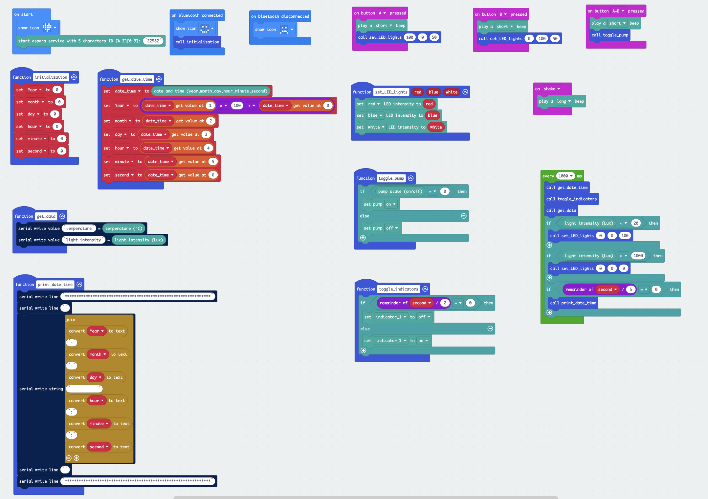
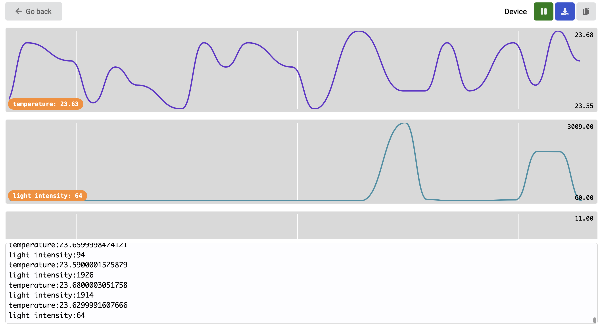

## Introduction
* To demo the uses of the values from <B>aspara Wireless Planting Sensor</B> in the <B>aspara Smart Grower</B> MakeCode extension.

## Control actions
* Press the "A" button would turn on the "RED" and "WHITE" led lights.
* Press the "B" button would turn on the "BLUE" and "WHITE" led lights.
* Press the "A+B" button would toggle the pump on/off state.
* Shack the micro:bit would beep the aspara Smart Grower.

## Use the Light Values from aspara Wireless Planting Sensor to turn on/off the aspara Smart Grower led lights.
* If you place an aspara Wireless Planting Sensor under the LED lights of the aspara Smart Grower and press "A" or "B" button, the LED light values would feed back to the micro:bit, and then the micro:bit would turn off the LED lights automatically if the value is higher than a threshold.
* If you use a finger to cover the light window on the aspara Wireless Planting Sensor, the LED light values would feed back to the micro:bit, and the micro:bit would turn on the WHITE led light if the value is lower than a threshold.

* If you inspect the data from the <B>"Show data from device"</B>, you could see, for example,

## Compatibility

* Works with <B>micro:bit V2</B> hardware only
